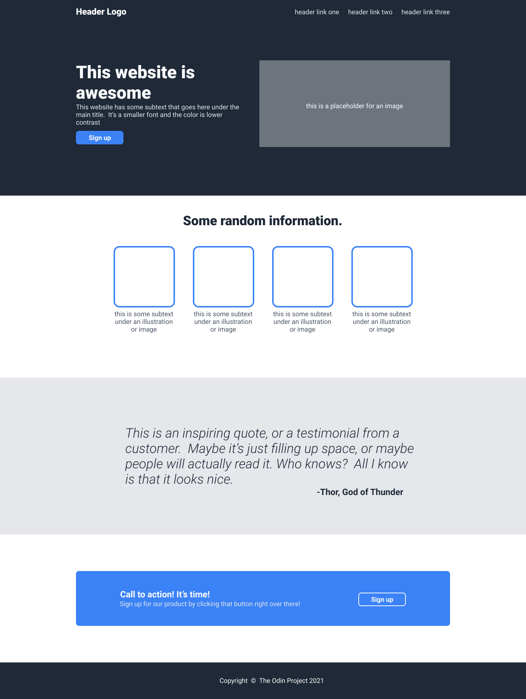

# Odin Landing Page

This is my final project for the CSS section of [The Odin Project](https://www.theodinproject.com/).

In this assignment, I recreated a landing page based on a provided design image (`design_example.png`).
The finished page is supposed to mimic the design reference as closely as possible while practicing layout and styling with HTML and CSS.

## Design Reference

This is the target image the page is meant to mimic:

## Project Objective

- Recreate a webpage design as accurately as possible
- Apply CSS layout techniques, especially Flexbox
- Strengthen understanding of spacing, alignment, and typography
- Combine new CSS skills with prior HTML knowledge

## What I Practiced

- Structuring semantic HTML for a multi-section landing page
- Using Flexbox for:
  - horizontal and vertical alignment
  - spacing between elements
  - responsive-friendly layout structure
- Working with:
  - margins and padding
  - font sizing and weight
  - color palettes and contrast
  - button and section styling

## Reflection

This project helped me connect everything I learned so far in CSS.
Rebuilding a design from an image made me think carefully about layout decisions and how small styling choices affect the final result.

It also improved my confidence with Flexbox and reinforced how important clean HTML structure is when styling a page.

## Built With

- HTML5
- CSS3
- Flexbox

## Live Preview

`https://asappayani.github.io/odin-landing-page/`

## Acknowledgments

- [The Odin Project](https://www.theodinproject.com/) for the assignment and curriculum
